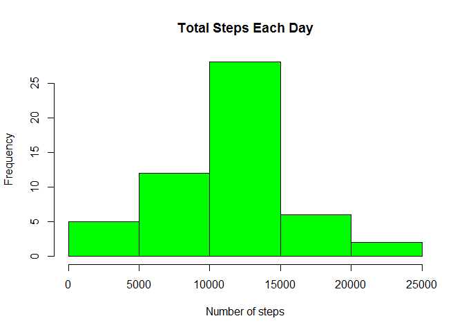

# Reproducible Research: Peer Assessment 1


### Loading and preprocessing the data

```r
library(data.table)
walkData <- read.csv("activity.csv")
head(walkData)
```

```
##   steps       date interval
## 1    NA 2012-10-01        0
## 2    NA 2012-10-01        5
## 3    NA 2012-10-01       10
## 4    NA 2012-10-01       15
## 5    NA 2012-10-01       20
## 6    NA 2012-10-01       25
```
###What is mean total number of steps taken per day?

```r
#taking away the NA values
walkDataNoNA <- walkData[!is.na(walkData[1]),]
#1. Calculate the total number of steps taken per day
walkTotal <- aggregate(walkDataNoNA$steps, by = list(walkDataNoNA$date), FUN = sum)
setnames(walkTotal, c("date", "steps"))
#2. Histogram of the total number of steps taken each day
hist(walkTotal$steps, xlab = "Number of steps", main = "Total Steps Each Day", col="GREEN")
```

 

```r
#3. Calculate the mean and median of the total number of steps taken per day
meanStep <- mean(walkTotal$steps)
medianStep <- median(walkTotal$steps)
```
- The mean number of steps is 

```
## [1] 10766.19
```
- The median number of steps is

```
## [1] 10765
```

###What is the average daily activity pattern

```r
#1. calculating the average steps for each interval and plot
walkAverage <- aggregate(walkDataNoNA$steps , by = list(walkDataNoNA$interval), FUN = mean)
setnames(walkAverage, c("interval", "averageStep"))
plot(x = walkAverage$interval, y = walkAverage$averageStep, type = "l", xlab = "Interval", ylab =  "Average number of steps", main = "Time series of average number of steps per interval")
```

 

```r
#2. Which 5-minute interval, on average across all the days in the dataset, contains the maximum number of steps?
avgIntervalMax <- max(walkAverage$averageStep)
maxOfRow <- walkAverage[which.max(walkAverage$averageStep),]
```

- The maxium number of steps for interval is

```
##     interval averageStep
## 104      835    206.1698
```


###Imputting missing values

```r
#1.total number of missing values
totalNAMissing <- sum(is.na(walkData[1]))
```

1. total number of missing values in the dataset

```
## [1] 2304
```


```r
#2.strategy to fill in missing values
walkTotal$date <- strptime(walkTotal$date, format = "%Y-%m-%d")
plot(x = walkTotal$date, y = walkTotal$steps, xlab = "Date", ylab = "Total steps")
```

 
  
From the graph, it looks like the total number of steps each day is about the same.  
So the strategy used to replace the NA values is by using the average steps for each interval.  


```r
walkDataNa <- walkData[is.na(walkData[1]),]
mergeNA <- merge(x = walkDataNa, y = walkAverage, by = "interval")
mergeNA <- mergeNA[, c("averageStep", "date", "interval")]
setnames(mergeNA, c("steps", "date", "interval"))
combined <- rbind(walkDataNoNA, mergeNA)

#4.
walkDataCombined <- aggregate(combined$steps, by = list(combined$date), FUN = sum)
setnames(walkDataCombined, c("date", "totalSteps"))
hist(walkDataCombined$totalSteps, xlab = "Number of Steps", main = "Total Steps Each Day", col = "Red")
hist(walkTotal$steps, col = "Green", add=T)
legend("topright", col = c("GREEN", "RED"), legend = c("no NA", "NA replaced"), lty=c(1,1), cex = 0.9, bty = "n",)
```

 

```r
combinedMean <- mean(walkDataCombined$totalSteps)
combinedMedian <- median(walkDataCombined$totalSteps)
```
- The combined mean step each day is 

```
## [1] 10766.19
```
- The combined median step each day is 

```
## [1] 10766.19
```
- There is no much difference between the estimate and the first graph other than higher value in the middle.  
- The impact of imputting data is to increase the frequency of the days that have total steps matching the mean. 


###Are there differences in activity patterns between weekdays and weekends?

```r
#1. factor variable for weekday and weekend
weekdays <- c('Monday', 'Tuesday', 'Wednesday', 'Thursday', 'Friday')
combined$date <- as.Date(combined$date)
combined$weekDay <- factor((weekdays(combined$date) %in% weekdays), levels = c(FALSE, TRUE), labels=c("weekend", "weekday"))
#2. panel plot of intervals and average number of steps taken.
combinedAvg <- aggregate(combined$steps, by = list(combined$interval, combined$weekDay), FUN = mean)
setnames(combinedAvg, c("interval", "weekDays", "averageStep"))
library(lattice)
xyplot(combinedAvg$averageStep ~ combinedAvg$interval|combinedAvg$weekDays, main="Average Steps per Day by Interval",xlab="Interval", ylab="Steps",layout=c(1,2), type="l")
```

 
